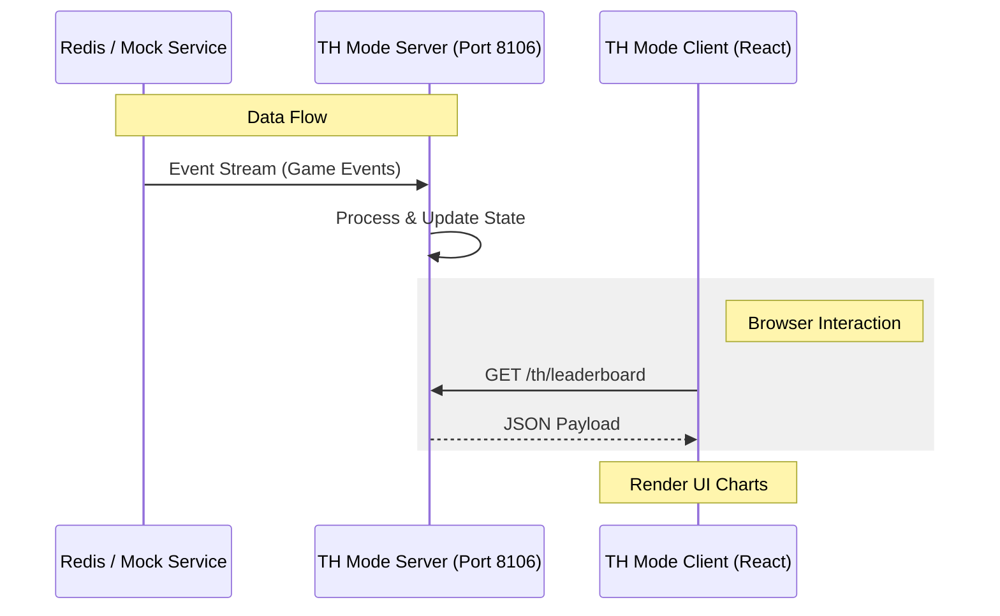

# 💣 BombCrypto API v2 - Deep Scribe Edition


## 🎯 O "Porquê"
Este repositório é o coração da infraestrutura de monitoramento e automação para o ecossistema BombCrypto. Ele foi projetado para ser resiliente, extensível e fácil de testar, permitindo que desenvolvedores visualizem o estado dinâmico do modo **Treasure Hunt** (TH) em tempo real.

---

## 🏗️ Arquitetura do Sistema

O fluxo de dados é otimizado para baixa latência, permitindo o uso de dados reais via Redis ou simulações via Mock.



---

## 🚀 Quick Start (Local Dev)

Para subir o ambiente local com as configurações de perícia aplicadas:

### 1. Pré-requisitos
- Docker & Docker Compose
- Node.js v18+ (para o cliente local)

### 2. Configuração do Backend
O modo simulation (Mock) já vem ativado por padrão no `compose.yaml`:
```bash
docker compose up -d
```
> [!NOTE]
> O CORS está liberado (`*`) no modo desenvolvimento para permitir que o frontend React acesse a API livremente.

### 3. Execução do Frontend
Navegue até a pasta do cliente e inicie o Vite:
```bash
cd th-mode-client
npm install
npm start
```

O dashboard estará disponível em `http://localhost:5173`.

---

## 📚 Documentação Adicional
- [**SYSTEM_ATLAS.md**](./SYSTEM_ATLAS.md): Inventário técnico detalhado de endpoints e variáveis de ambiente.
- [**rpc-api/README.md**](./rpc-api/README.md): Detalhes sobre a interface RPC.
- [**th-mode-server/README.md**](./th-mode-server/README.md): Logs de desenvolvimento do servidor.

---

> [!IMPORTANT]
> **Segurança em Produção:** Lembre-se de configurar o `ALLOWED_ORIGIN` no `th-mode-server` e desativar o `USE_MOCK_DATA` antes de fazer o deploy para ambientes públicos.

---
*Gerado com precisão pelo Deep Scribe ✍️*
