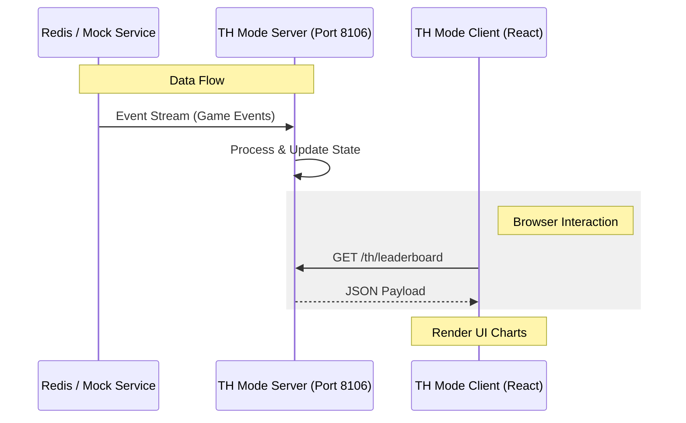

# 💣 BombCrypto API v2 - Deep Scribe Edition


## 🎯 The "Why"
This repository is the heart of the monitoring and automation infrastructure for the BombCrypto ecosystem. It was designed to be resilient, extensible, and easy to test, allowing developers to visualize the dynamic state of **Treasure Hunt** (TH) mode in real-time.

---

## 🏗️ System Architecture

The data flow is optimized for low latency, allowing for real-world data via Redis or simulations via Mock services.



---

## 🚀 Quick Start (Local Dev)

To spin up the local environment with the professional configurations applied:

### 1. Prerequisites
- Docker & Docker Compose
- Node.js v18+ (for local client)

### 2. Backend Configuration
Simulation mode (Mock) is active by default in the `compose.yaml`:
```bash
docker compose up -d
```
> [!NOTE]
> CORS is enabled (`*`) in development mode to allow the React frontend to access the API freely.

### 3. Frontend Execution
Navigate to the client folder and start Vite:
```bash
cd th-mode-client
npm install
npm start
```

The dashboard will be available at `http://localhost:5173`.

---

## 📚 Additional Documentation
- [**SYSTEM_ATLAS.md**](./SYSTEM_ATLAS.md): Detailed technical inventory of endpoints and environment variables.
- [**rpc-api/README.md**](./rpc-api/README.md): Details about the RPC interface.
- [**th-mode-server/README.md**](./th-mode-server/README.md): Server development logs.

---

> [!IMPORTANT]
> **Production Security:** Remember to configure `ALLOWED_ORIGIN` in the `th-mode-server` and disable `USE_MOCK_DATA` before deploying to public environments.

---
*Precisely generated by Deep Scribe ✍️*
